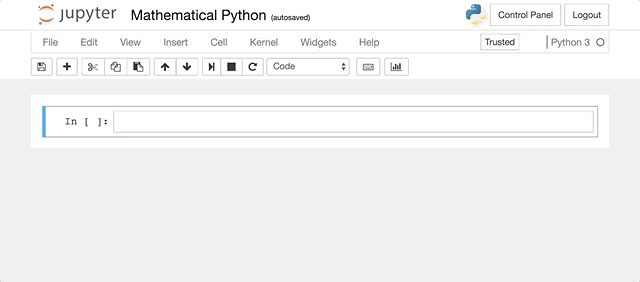

Do site do [Jupyter][1] obtemos a seguinte definição,

> The Jupyter Notebook is an open-source web application that allows you to create and share documents that contain live code, equations, visualizations and narrative text.

[1]: https://jupyter.org

Nessa seção, é apresentada a interface e as funções básicas do Jupyter Notebook. Você pode visualizar o tour pela interface indo em *Help* na barra de navegação.



??? Info "IPython &rarr; Jupyter &rarr; Google Colab"
    O Jupyter, na verdade, foi a continuação de uma outra tecnologia chamada de IPython. O IPython introduziu um novo paradigma de programação e analise de dados. Com esse paradigma tornava-se possível misturar texto, código, imagens, vídeos entre vários outros conteúdos visuais ao código.

    Os gráficos podiam ter seus parâmetros alterados de forma interativa. Podíamos publicar os resultados obtidos em html, pdf e markdown. Nunca havia sido tão fácil compartilhar os resultados de análises e ensaios.

    O projeto IPython foi descontinuado, porém o Jupyter seguiu o desenvolvendo, e agora trazendo uma roupagem nos navegadores. Hoje em dia não precisamos nem memso instalar o Jupyter nos nossos computadores, basta acessarmos o [Google Colab][2]. O Google Colab fica vinculado a sua conta do Google e funciona como um Google Docs para notebooks Python.

[2]: http://colab.research.google.com

## Instalação

A instalação do Jupyter Notebook é opcional. Caso você não tenha o intuito de utilizar os seis notebooks offline, ou ainda fazer outras analises, basta acessar o [Google Colab][2].

### Vantagens do Google Colab

O Google Colab tem a vantagem de:

- Não necessitar instalações no cliente
- Poder ser acessado de qualquer lugar
- Você pode destruir o ambiente python e nada acontece com a sua máquina
- Caso seja necessário, você pode usar placas de vídeos e TPUs para acelerar os seus códigos.

??? Question "Placas de Vídeo? TPUs?"
    As placas de vídeos ou GPUs, são unidades de processamento otimizadas para operações com matrizes e vetores. Dessa forma, calcular somas e multiplicações se torna muito mais rápido.
    As [TPUs][3] são uma evolução das GPUs. Desenvolvidas pela Google, as TPUs são otimizadas para operações com [tensores][4] agilizando ainda mais os cálculos no mundo do [deep learning][5].

- Versionamento automático dos códigos
- Acesso via Github

[3]: https://cloud.google.com/tpu/docs/tpus
[4]: https://en.wikipedia.org/wiki/Tensor
[5]: https://youtu.be/njKP3FqW3Sk
## Células

No Jupyter você se deparará com dois tipos principais de células: as de código e as de texto (ou markdown). Para executar as células utilize `SHIFT + ENTER` para executar e criar uma nova célula, ou `CTRL + ENTER` para executar e permanecer na mesma célula.

Células de Markdowns podem conter:

- Texto
- Expressões em LaTeX
- HTML
- Markdown
- Imagens
- Vídeos
- Links
- Basicamente, *tudo* que um navegador entenda

Os códigos Python são escritos nas células de código.

```python linenums="1"
# Dobra e mostra os números em [-4,4]
for i in range(-4,4):
    print(2 * i)
```

```
-8
-6
-4
-2
0
2
4
6
```

## Atalhos

Os principais comandos para navegar no jupyter são os seguintes:

|        Comandos       |      Atalho     |
|:---------------------:|:---------------:|
| Inserir Célula a Cima |       `a`       |
| Inserir Célula Abaixo |       `b`       |
|     Copiar Célula     |       `c`       |
|     Cortar Célula     |       `x`       |
|     Colar Célula      |       `v`       |
| Para Célula de Código |       `y`       |
|  Para Célula de Texto |       `m`       |
|     Executar Célula   | `SHIFT + ENTER` |

Contudo, muito provavelmente você usará muito mais o `SHIFT + ENTER`, o `a` e o `x`. Caso você queira achar mais comandos, vá na aba de *Help*.